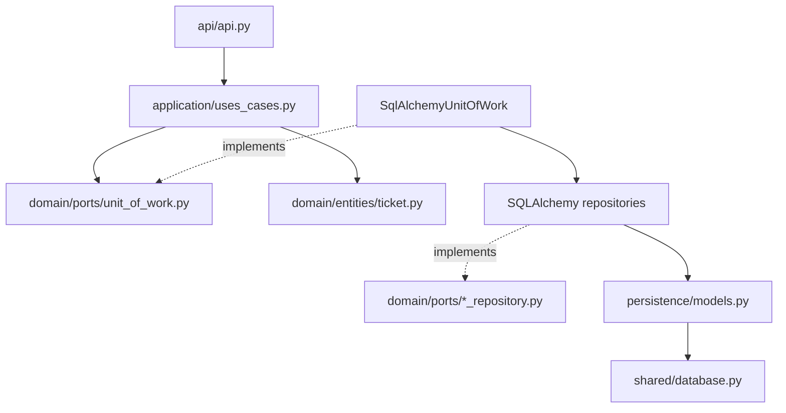

# Módulo Tickets

Gestiona la creación, consulta, aprobación y eliminación de tickets. Sigue DDD ligero: el dominio define entidades y puertos; la aplicación orquesta los casos de uso; infraestructura contiene los detalles de SQLAlchemy.

## Estructura

```
tickets/
├── api/                            # Router FastAPI y DTOs
├── domain/
│   ├── entities/ticket.py          # Entidad pura (dataclass, UUID)
│   └── ports/                      # Protocols: repositorios, dispositivos y UoW
├── application/                    # Casos de uso de tickets, QR, código e impresión
└── infrastructure/sqlalchemy/
    ├── persistence/models.py       # Modelos ORM
    ├── methods/                    # Repositorios SQLAlchemy
    └── unit_of_work.py             # Transacción y repositorios de la sesión
```

## Capas

| Capa | Responsabilidad | Depende de |
|---|---|---|
| `domain` | Entidad `Ticket` y protocols de repositorio, dispositivos y UoW | Nada |
| `application` | Casos de uso: crear, listar, obtener, borrar y aprobar tickets | `domain` |
| `infrastructure` | SQLAlchemy, repositorios y UoW concreto | `domain` + `shared.database` |
| `api` | Endpoints FastAPI y dependencias | `application` + `infrastructure` |

El dominio no conoce SQLAlchemy. La aplicación recibe un `UnitOfWorkFactory` tipado mediante protocol, por lo que opera contra puertos, no contra la sesión o modelos ORM.



## Flujo de una petición

1. FastAPI construye un `SqlAlchemyUnitOfWork` mediante la factoría de sesiones compartida.
2. El caso de uso abre el UoW, trabaja con `uow.tickets` o `uow.ticket_codes` y devuelve entidades de dominio.
3. Al salir correctamente, el UoW confirma la transacción; ante una excepción, revierte y siempre cierra la sesión.

## Persistencia

`TicketModel` es el modelo SQLAlchemy de la tabla `tickets`. `SQLAlchemyTicketRepository` realiza el mapeo explícito entre el modelo y `Ticket`. La `Base` común vive en `shared/database.py`; así todos los modelos del proyecto comparten el mismo metadata.

## Casos de uso actuales

- `CreateTicket`, `ListTickets`, `GetTicketById`, `DeleteTicket` y `ApproveTicket` usan el Unit of Work.
- `TicketCodeUseCase`, `TicketQrUseCase` y `TicketPrinterUseCase` dependen de sus respectivos puertos de dominio.

La API expone `/tickets` para las operaciones CRUD disponibles y `/tickets/{ticket_id}/approve` para aprobar un ticket.
