# Arquitectura del sistema

## Objetivo

El sistema separa la experiencia web de las reglas de negocio. Nuxt presenta dos portales segun el rol; FastAPI autentica, autoriza y ejecuta los casos de uso; PostgreSQL conserva el estado y garantiza la unicidad de los codigos.

## Contexto

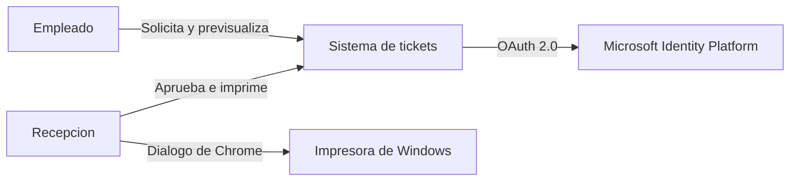

## Contenedores

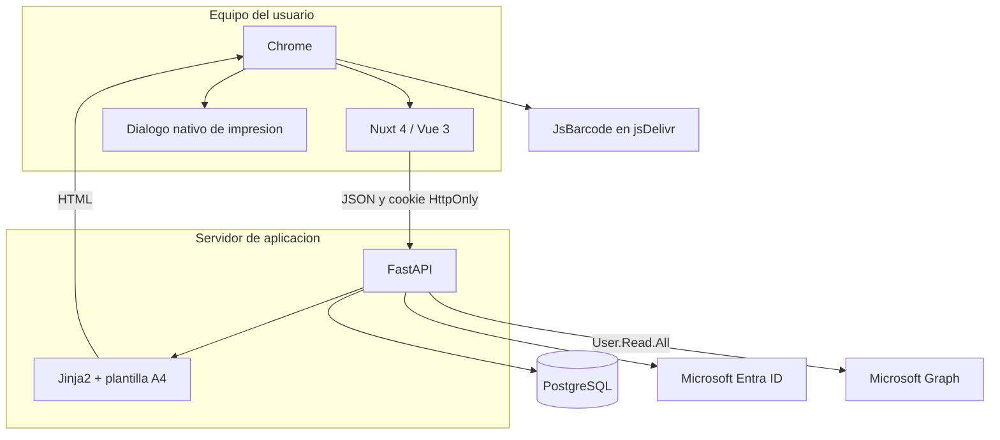

## Responsabilidades

| Capa | Responsabilidad | No debe decidir |
|---|---|---|
| Nuxt | Rutas, formularios, modales, paginacion, mensajes y navegacion | Permisos finales, codigos o transacciones |
| FastAPI API | Contrato HTTP, autenticacion, autorizacion y traduccion de errores | Detalles visuales de las paginas Nuxt |
| Aplicacion | Casos de uso y orden de operaciones | SQL o componentes Vue |
| Dominio | Entidades, estados y puertos | FastAPI, salvo el puerto HTML actual |
| Infraestructura | SQLAlchemy, MSAL, JWT, Jinja2 y PostgreSQL | Flujos de interfaz |
| PostgreSQL | Persistencia, relaciones, unicidad y asignacion atomica de secuencias | Presentacion |

## Dependencias internas

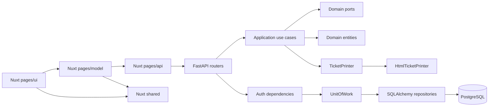

El frontend sigue una variante pequena de Feature-Sliced Design: `app` compone, `pages` contiene funcionalidades y `shared` contiene capacidades transversales. El backend agrupa por modulo y dentro de cada modulo separa API, aplicacion, dominio e infraestructura.

## Autenticacion y autorizacion

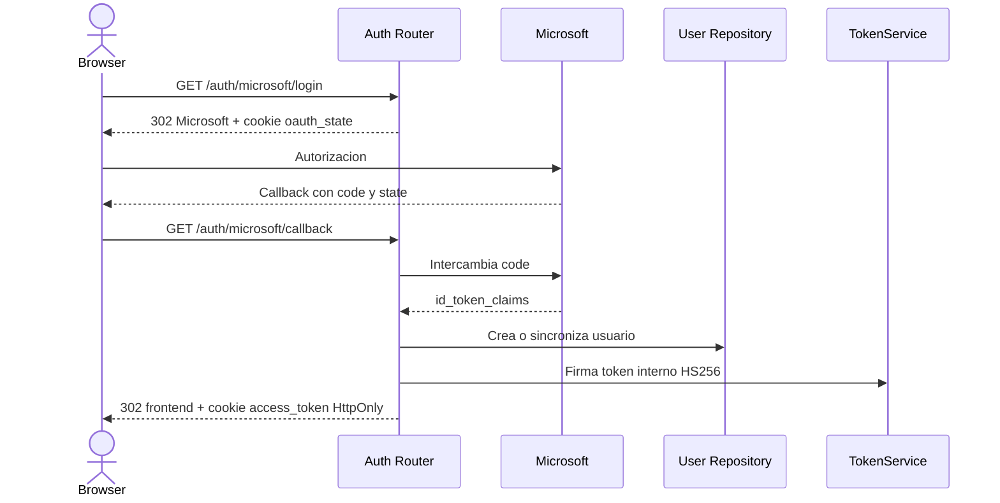

El JWT solo contiene el ID del usuario. Cada peticion protegida vuelve a consultar PostgreSQL, por lo que un cambio de rol o una eliminacion se aplica inmediatamente.

RRHH puede bloquear una identidad del directorio por su OID estable. El callback OAuth y
`current_user` consultan la tabla local de bloqueos, por lo que no se crea una nueva sesion y las
sesiones existentes dejan de acceder sin depender de Graph. El bloqueo conserva usuarios,
historial y solicitudes pendientes.

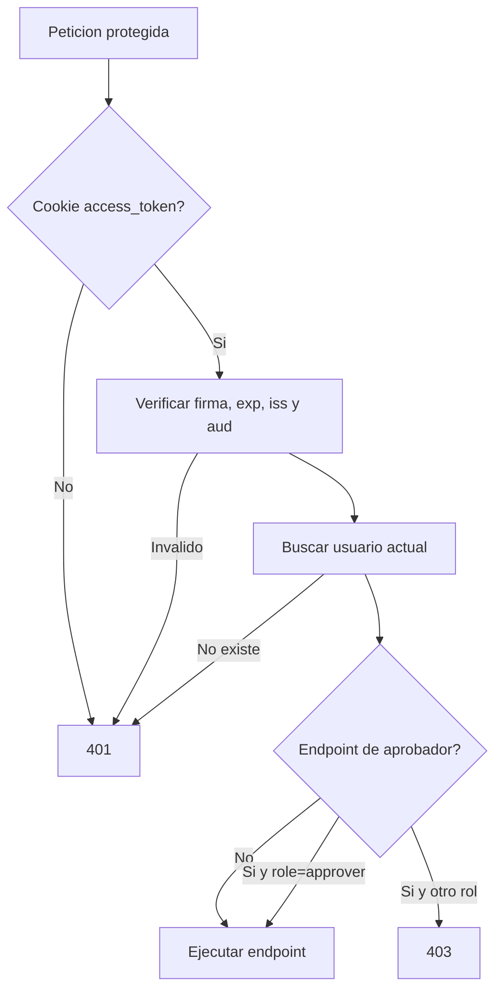

## Ciclo de una solicitud

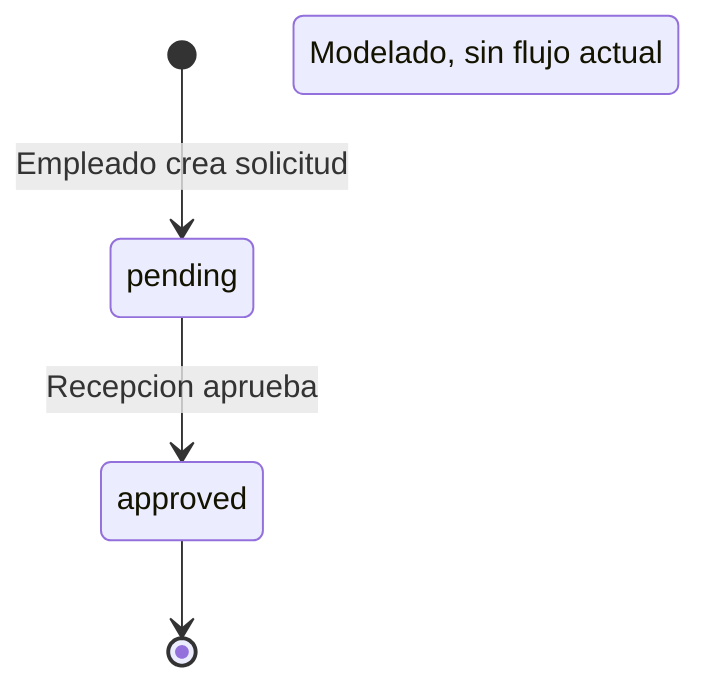

Cantidades aceptadas por la API: 11 o 22. La restriccion vive en el DTO de entrada, no en la base de datos.

## Creacion

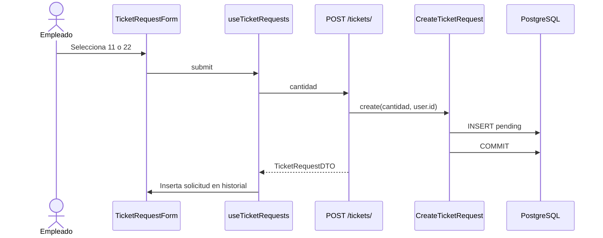

## Aprobacion y emision

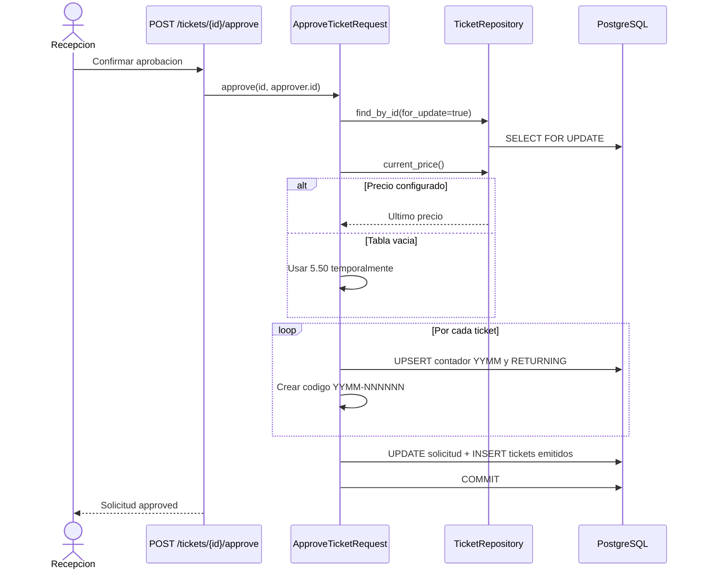

El bloqueo de fila evita aprobar dos veces la misma solicitud. El `UPSERT` del contador evita repetir secuencias cuando se aprueban solicitudes concurrentemente.

## Previsualizacion e impresion

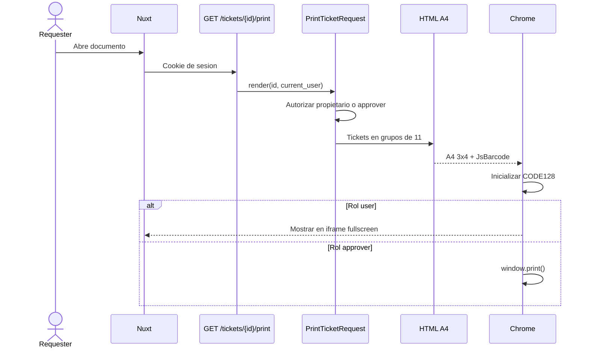

La celda 12 de cada hoja se reserva para firma. Por eso 11 tickets producen una hoja y 22 producen dos.

## Modelo de datos

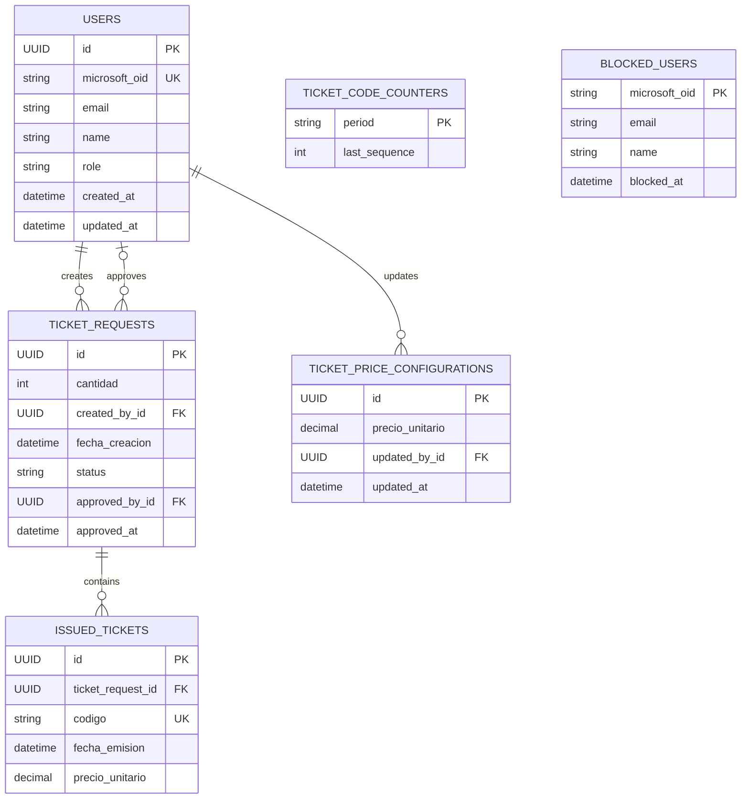

El precio se copia al ticket emitido. Un cambio posterior de tarifa no altera tickets historicos.

## Rutas y roles

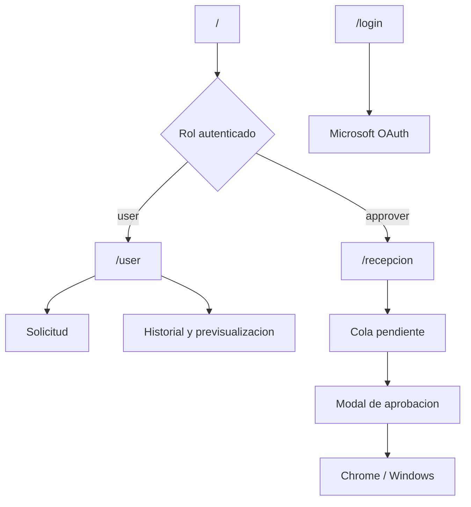

| Ruta web | Rol | Finalidad |
|---|---|---|
| `/login` | Publica | Iniciar sesion |
| `/` | Autenticado | Redirigir segun rol |
| `/user` | `user` | Solicitar y consultar tickets propios |
| `/recepcion` | `approver` | Aprobar e imprimir solicitudes |

## Limites deliberados

- Chrome gestiona las impresoras; la web no las enumera ni confirma impresion fisica.
- No existe cola persistente de trabajos de impresion.
- La previsualizacion usa HTML A4, no un archivo PDF.
- El precio `5.50` es un respaldo temporal hasta implementar administracion.
- `rejected` existe en el modelo, pero no hay transicion implementada.
- JsBarcode se descarga de un CDN al abrir el documento.
- El CORS actual solo contempla el entorno local.

## Extension segura

Cuando se agregue funcionalidad, el punto de entrada recomendado es:

1. Definir o ampliar entidad y puerto del dominio.
2. Implementar un caso de uso pequeno.
3. Adaptar persistencia si hace falta.
4. Exponerlo en el router y OpenAPI.
5. Regenerar `frontend/src/shared/api/openapi.ts`.
6. Consumirlo desde `pages/*/api`, no directamente desde componentes.
7. Añadir la prueba minima que proteja la nueva regla.
