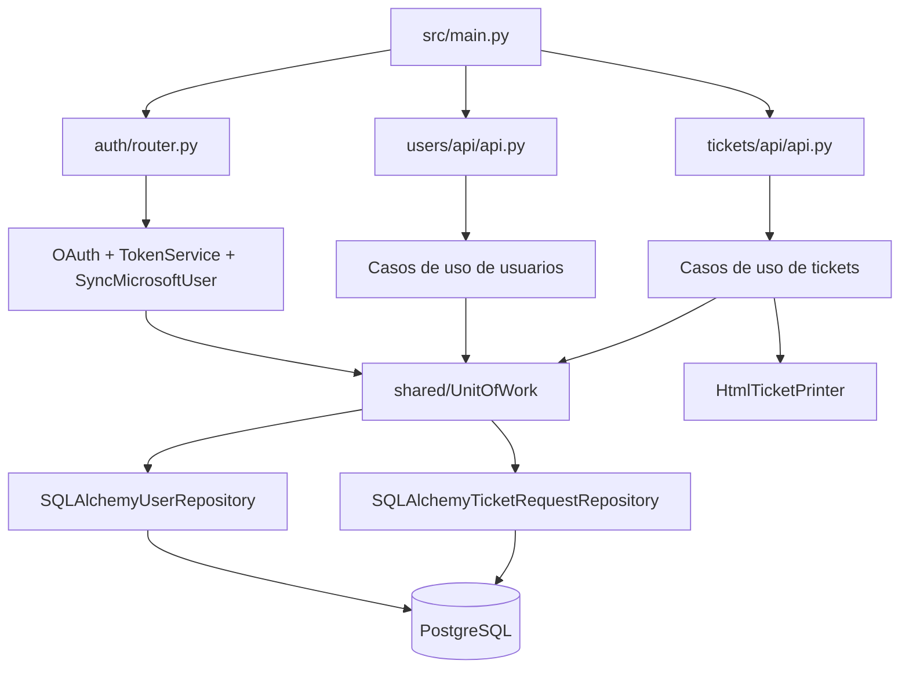
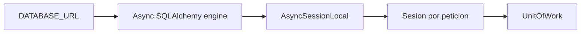
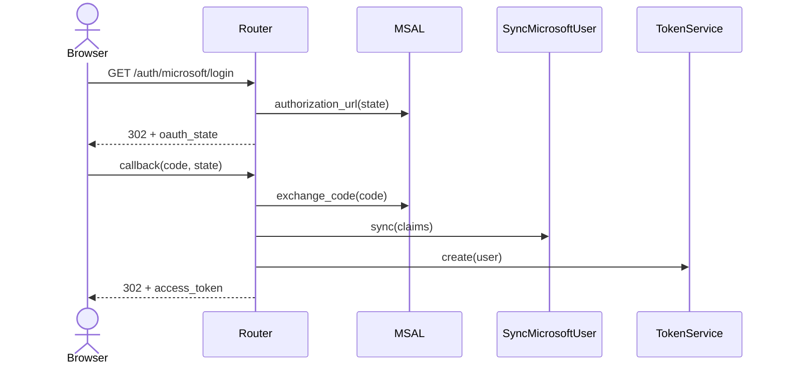
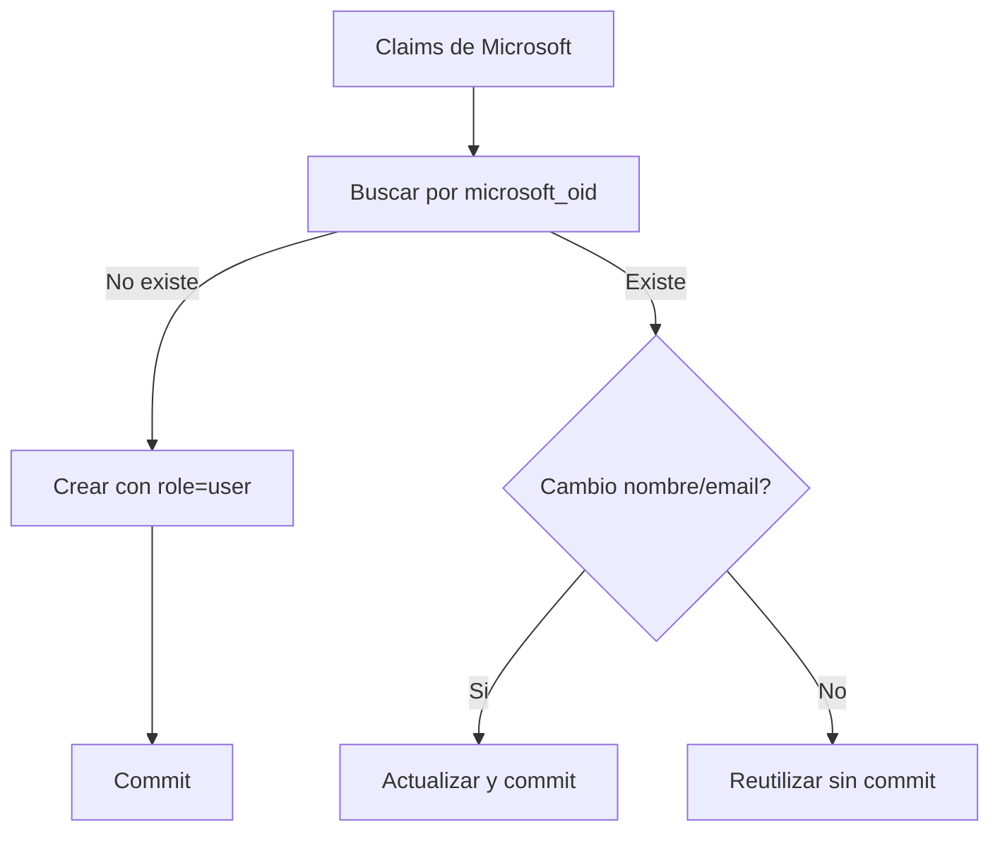
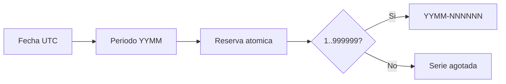
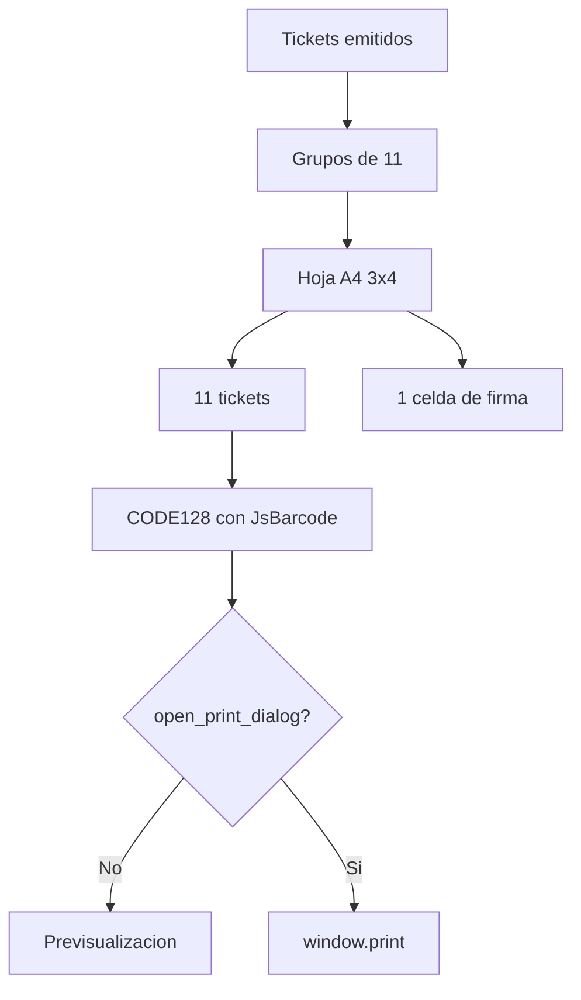

# Referencia de modulos del backend

## Resumen

El backend es una API asincrona FastAPI organizada por funcionalidad. Cada modulo intenta separar contrato HTTP, casos de uso, entidades/puertos e infraestructura.

```text
backend/
|-- alembic/                       Migraciones
|-- src/
|   |-- main.py                    Composicion de FastAPI
|   |-- shared/                    Base de datos y Unit of Work
|   `-- modules/
|       |-- auth/                  OAuth, JWT y sesion
|       |-- users/                 Usuarios y roles
|       `-- tickets/               Solicitudes, emision y A4
|-- pyproject.toml                 Dependencias y herramientas
`-- uv.lock                        Resolucion reproducible
```

## Mapa de modulos



## Composicion y shared

### `src/main.py`

Punto de composicion de la API:

- Crea `FastAPI`.
- Configura CORS para `http://localhost:3000` con cookies.
- Monta los routers de autenticacion, usuarios y tickets.

No crea tablas ni ejecuta migraciones al arrancar.

### `src/shared/database.py`

Responsabilidades:

- Cargar `.env`.
- Exigir `DATABASE_URL`.
- Normalizar `postgresql://` a `postgresql+asyncpg://`.
- Crear el motor asincrono y `AsyncSessionLocal`.
- Exponer `Base` para los modelos.
- Proporcionar una sesion por peticion mediante `get_db()`.



### `src/shared/uow.py`

`UnitOfWork` agrupa repositorios y la transaccion:

| Miembro | Implementacion |
|---|---|
| `users` | `SQLAlchemyUserRepository` |
| `ticket_requests` | `SQLAlchemyTicketRequestRepository` |
| `ticket_codes` | `SQLAlchemyTicketRequestRepository` |
| `commit()` | Confirma la sesion |
| `rollback()` | Revierte la sesion |

Los casos de uso llaman a `commit()` explicitamente. Los endpoints actuales no usan el context manager del UoW.

## Modulo `auth`

### Finalidad

Conectar Microsoft Entra ID con una sesion interna de la aplicacion. Microsoft autentica la identidad; el backend conserva usuario y rol en PostgreSQL.

```text
modules/auth/
|-- config.py                    Configuracion
|-- microsoft.py                 Adaptador MSAL
|-- internal_token_service.py    JWT interno
|-- dependencies.py              current_user y UoW
|-- router.py                    Endpoints OAuth/sesion
`-- tests/                       Pruebas del flujo
```

### `config.py`

`AuthSettings` lee:

| Variable | Uso |
|---|---|
| `MICROSOFT_TENANT_ID` | Autoridad de Microsoft |
| `MICROSOFT_CLIENT_ID` | Identificador de aplicacion |
| `MICROSOFT_CLIENT_SECRET` | Credencial confidencial |
| `MICROSOFT_REDIRECT_URI` | Callback de OAuth |
| `AUTH_COOKIE_SECRET` | Firma del JWT interno |
| `AUTH_SUCCESS_REDIRECT_URL` | Destino frontend tras login |
| `AUTH_COOKIE_SECURE` | Marca `Secure` de cookies |

Constantes relevantes:

- Cookie de sesion: `access_token`.
- Cookie OAuth: `oauth_state`.
- Sesion: 3600 segundos.
- State: 600 segundos.
- JWT HS256, issuer `tickets-api`, audience `tickets-web`.

### `microsoft.py`

`MicrosoftOAuth` encapsula MSAL:

- Construye la URL de autorizacion.
- Intercambia el codigo del callback.
- Solicita el scope `email`.
- Rechaza respuestas de error o claims ausentes.

MSAL es sincrono; el router lo ejecuta con `asyncio.to_thread()` para no bloquear el event loop.

### `internal_token_service.py`

`TokenService` crea y valida el JWT interno. Solo almacena el UUID en `sub`; no copia email, nombre ni rol. Esto obliga a consultar el usuario actual en cada peticion y evita roles obsoletos en el token.

### `dependencies.py`

`current_user()`:

1. Lee `access_token`.
2. Valida JWT, expiracion, issuer y audience.
3. Convierte `sub` a UUID.
4. Busca el usuario actual.
5. Devuelve 401 ante cualquier sesion invalida o usuario eliminado.

### `router.py`

| Metodo | Ruta | Funcion |
|---|---|---|
| GET | `/auth/microsoft/login` | Crear state y redirigir a Microsoft |
| GET | `/auth/microsoft/callback` | Validar state, sincronizar usuario y crear sesion |
| GET | `/auth/me` | Devolver usuario autenticado |
| POST | `/auth/logout` | Eliminar cookies |



## Modulo `users`

### Finalidad

Representar usuarios corporativos, sincronizar sus datos y administrar el rol de aprobador.

```text
modules/users/
|-- api/                         DTO, endpoints y require_approver
|-- application/                 Casos de uso
|-- domain/                      User, UserRole y puerto
|-- infrastructure/sqlalchemy/   Modelo y repositorio
`-- tests/
```

### Dominio

`domain/entities/users.py`:

| Tipo | Campos/valores |
|---|---|
| `UserRole` | `user`, `approver` |
| `User` | ID, Microsoft OID, email, nombre, rol y timestamps UTC |

`domain/ports/user_repository.py` define:

- `add`
- `get_by_id`
- `get_by_microsoft_oid`
- `get_by_email`
- `list_all`
- `update`
- `delete`

### Casos de uso

| Clase | Archivo | Responsabilidad |
|---|---|---|
| `CreateUser` | `application/create_user.py` | Guardar y confirmar un usuario |
| `GetUserById` | `application/get_user_by_id.py` | Obtener o fallar si no existe |
| `ListUsers` | `application/list_users.py` | Listar usuarios |
| `UpdateUser` | `application/update_user.py` | Actualizar timestamp, guardar y confirmar |
| `DeleteUser` | `application/delete_user.py` | Verificar, eliminar y confirmar |
| `SyncMicrosoftUser` | `application/sync_microsoft_user.py` | Crear o sincronizar nombre/email desde Microsoft |

Solo sincronizacion, consulta para autenticacion, cambio de rol y eliminacion estan expuestos actualmente por HTTP.

### Sincronizacion Microsoft



El rol existente nunca se reemplaza con datos de Microsoft.

### API y permisos

`api/dependencies.py` contiene `require_approver()`, que devuelve 403 para cualquier otro rol.

| Metodo | Ruta | Permiso | Caso de uso |
|---|---|---|---|
| PATCH | `/users/{id}/role` | `approver` | `UpdateUser` |
| DELETE | `/users/{id}` | `approver` | `DeleteUser` |

No hay endpoint para listar usuarios, aunque existe el caso de uso.

### Bloqueo de acceso

RRHH busca identidades directamente en Microsoft Graph mediante client credentials. La
aplicacion de Entra requiere `User.Read.All` como permiso de aplicacion y consentimiento de
administrador.

| Metodo | Ruta | Finalidad |
|---|---|---|
| GET | `/users/microsoft/search?q=...` | Buscar por nombre o correo |
| GET | `/users/blocked` | Listar identidades bloqueadas |
| PUT | `/users/blocked/{microsoft_oid}` | Bloquear o refrescar una identidad |
| DELETE | `/users/blocked/{microsoft_oid}` | Desbloquear una identidad |

`blocked_users` no tiene clave foranea hacia `users`: permite bloquear a alguien que nunca ha
entrado y evita que eliminar su usuario local quite el bloqueo. El OID aplica la regla; nombre y
correo son solo una instantanea visual. `current_user` rechaza sesiones bloqueadas y el callback
OAuth no emite una nueva cookie.

### Persistencia

`UserModel` mapea `users`:

- UUID como clave primaria.
- `microsoft_oid` unico.
- Constraint de rol `user | approver`.
- Timestamps con zona horaria.

`SQLAlchemyUserRepository` convierte explicitamente entre ORM y entidad de dominio.

## Modulo `tickets`

### Finalidad

Gestionar solicitudes, aprobacion, emision inmutable de tickets, secuencias mensuales y documento A4.

```text
modules/tickets/
|-- api/                         DTO y endpoints
|-- application/                 Casos de uso
|-- domain/entities/             Solicitud, precio y ticket imprimible
|-- domain/ports/                Repositorios y renderer
|-- infrastructure/sqlalchemy/   Modelos y consultas
|-- infrastructure/html_ticket_printer.py
|-- template/tickets.html
`-- tests/
```

### Entidades

`domain/entities/ticket.py`:

| Entidad | Uso |
|---|---|
| `TicketRequestStatus` | `pending`, `approved`, `rejected` |
| `TicketRequest` | Solicitud y datos de aprobacion |
| `PendingTicketRequest` | Proyeccion de cola con nombre del solicitante |

`domain/entities/ticket_printer.py` define `PrintableTicket`, snapshot con nombre, codigo, fecha y precio.

`domain/entities/ticket_price.py` define `TicketPriceConfiguration`; aun no tiene API de administracion.

### Puertos

`TicketRequestRepository` abstrae solicitudes, precio y tickets emitidos. `TicketCodeRepository` abstrae la reserva atomica de secuencias. `TicketPrinter` abstrae el HTML final y recibe `open_print_dialog`.

### Casos de uso

#### `CreateTicketRequest`

- Crea estado `pending` con hora UTC.
- Persiste y confirma.
- La API limita cantidad a 11 o 22.

#### `GetTicketRequest`

- Busca por UUID.
- Puede exigir propiedad mediante `requester_id`.
- Oculta una solicitud ajena como no encontrada.

#### `ListPendingTickets`

Delega en una consulta que une solicitud y usuario y devuelve las pendientes mas antiguas primero.

#### `GenerateTicketCode`

Formato: `YYMM-NNNNNN`.



#### `ApproveTicketRequest`

- Bloquea la solicitud con `SELECT FOR UPDATE`.
- Solo acepta `pending`.
- Lee el ultimo precio; usa `5.50` si no existe.
- Genera un codigo por ticket.
- Copia precio y fecha en `issued_tickets`.
- Marca la solicitud `approved`.
- Confirma todo en una transaccion.

#### `PrintTicketRequest`

- Autoriza al propietario o a cualquier `approver`.
- Exige estado `approved`.
- Recupera el nombre actual del creador.
- Recupera tickets emitidos ordenados por codigo.
- Activa impresion automatica solo para `approver`.

### DTO

| DTO | Contenido |
|---|---|
| `TicketRequestCreateDTO` | `cantidad`, literal 11 o 22 |
| `TicketRequestDTO` | Solicitud completa sin tickets emitidos |
| `PendingTicketRequestDTO` | ID, nombre, cantidad y fecha |

### Endpoints

| Metodo | Ruta | Alcance |
|---|---|---|
| POST | `/tickets/` | Crear solicitud propia |
| GET | `/tickets/` | Listar solicitudes propias |
| GET | `/tickets/pending` | Cola para aprobadores |
| GET | `/tickets/{id}` | Detalle propio |
| GET | `/tickets/pending/{id}` | Detalle pendiente para aprobador |
| POST | `/tickets/{id}/approve` | Aprobar y emitir |
| GET | `/tickets/{id}/print` | HTML A4 para propietario o aprobador |

### Persistencia

`infrastructure/sqlalchemy/persistence/models.py` contiene:

| Modelo | Finalidad |
|---|---|
| `TicketRequestModel` | Estado de la solicitud |
| `IssuedTicketModel` | Ticket emitido y precio historico |
| `TicketCodeCounterModel` | Ultima secuencia por mes |
| `TicketPriceConfigurationModel` | Historial de precios |

Consultas relevantes de `ticket_request_repository.py`:

- `find_by_id(..., for_update=True)` aplica bloqueo de fila.
- `reserve_next_ticket_sequence()` usa `INSERT .. ON CONFLICT DO UPDATE .. RETURNING` de PostgreSQL.
- `current_price()` selecciona la configuracion mas reciente.
- `list_pending()` hace join con usuarios y ordena por fecha ascendente.
- `list_issued()` ordena por codigo.

### Documento A4

`HtmlTicketPrinter` divide en grupos de 11 y renderiza `template/tickets.html`.



Dimensiones:

- A4 vertical, 210 x 297 mm.
- Rejilla 3 x 4.
- Etiqueta 71 x 74 mm.
- Una hoja para 11 tickets; dos para 22.

## Esquema y migraciones

Alembic usa `Base.metadata` y el mismo `DATABASE_URL`. La migracion inicial crea las cinco tablas descritas en [Arquitectura](architecture.md#modelo-de-datos).

Comandos:

```bash
uv run --directory backend alembic upgrade head
uv run --directory backend alembic downgrade -1
```

## Matriz de errores

| Situacion | Respuesta actual |
|---|---|
| Sin cookie o token invalido | 401 |
| Rol insuficiente | 403 |
| Detalle propio inexistente/ajeno | 404 |
| Aprobacion invalida | 400 |
| Documento inexistente, ajeno o no aprobado | 400 |
| Cantidad distinta de 11/22 | 422 |

Los casos de uso usan `ValueError`; los routers traducen segun el endpoint.

## Pruebas

```text
modules/auth/tests/      OAuth, JWT, /me y logout
modules/users/tests/     Permisos, rutas y casos de uso
modules/tickets/tests/   Aprobacion, precio, codigos, permisos y HTML
```

Ejecutar:

```bash
uv run --directory backend pytest
uv run --directory backend ruff check src
uv run --directory backend basedpyright
```

No hay pruebas de integracion con PostgreSQL real ni de concurrencia.

## Configuracion operativa

El backend no ejecuta migraciones automaticamente. Arranque local:

```bash
uv run --directory backend uvicorn main:app --app-dir src --reload
```

OpenAPI queda disponible en `/docs` y `/openapi.json`.

## Limitaciones conocidas

- Sin API para administrar precios.
- Sin endpoint de rechazo.
- Sin proteccion contra autoeliminacion o autoperdida de rol de un aprobador.
- CORS local hardcoded.
- Codigos de barras dependientes de CDN.
- Listados propios sin orden SQL explicito; el frontend los ordena.
- El puerto `TicketPrinter` depende de tipos FastAPI y no es dominio puro.
