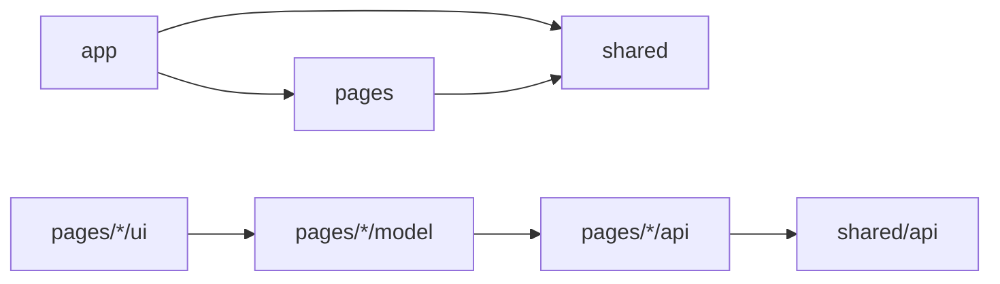
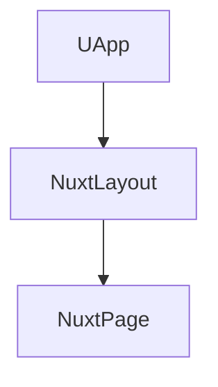
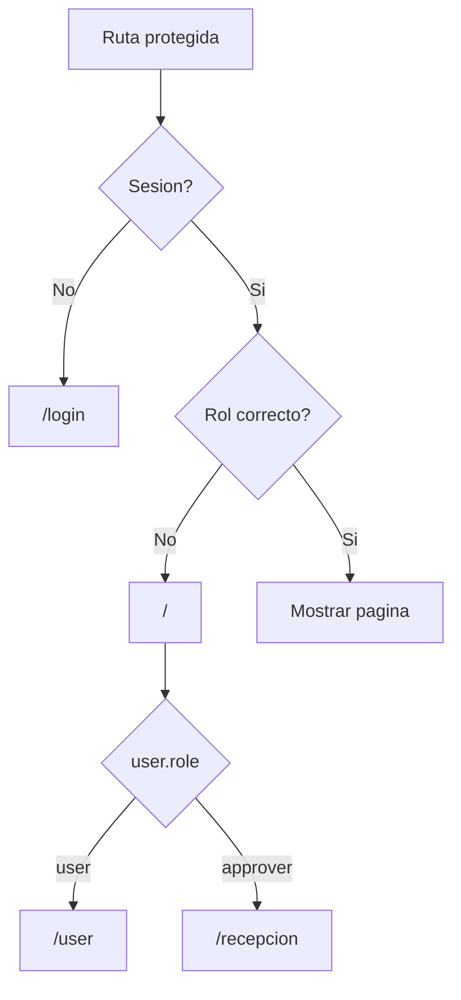
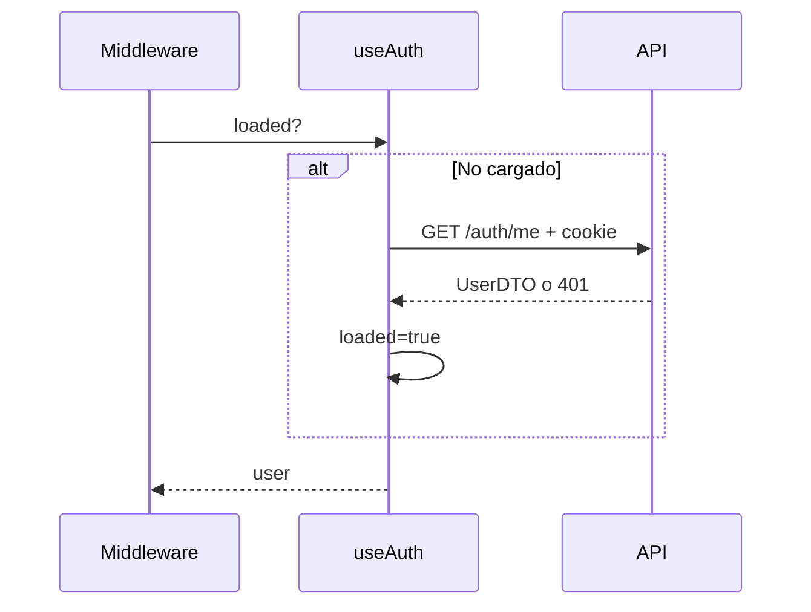
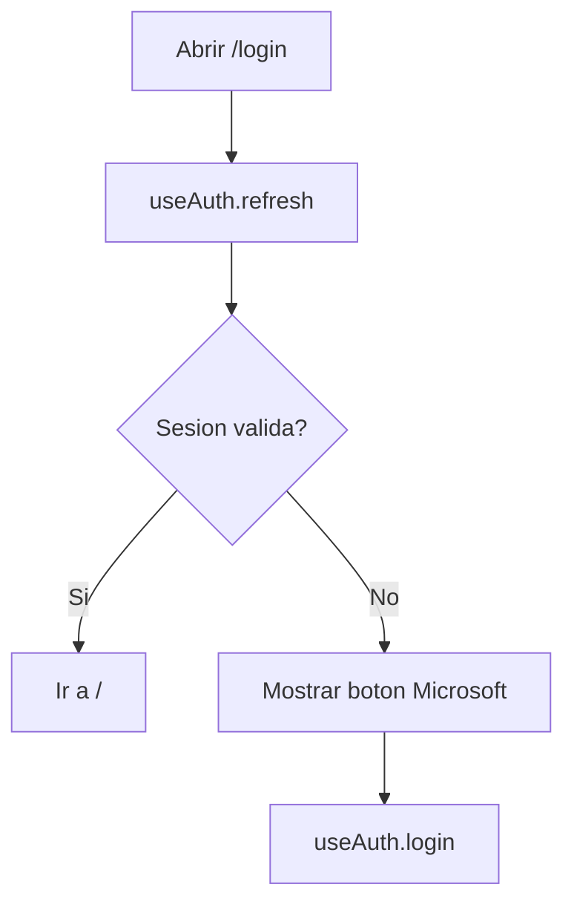
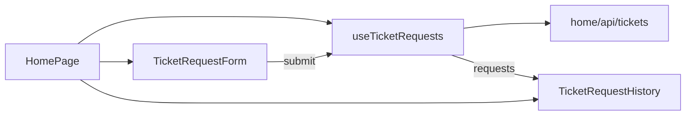
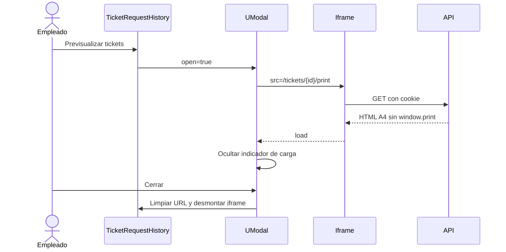
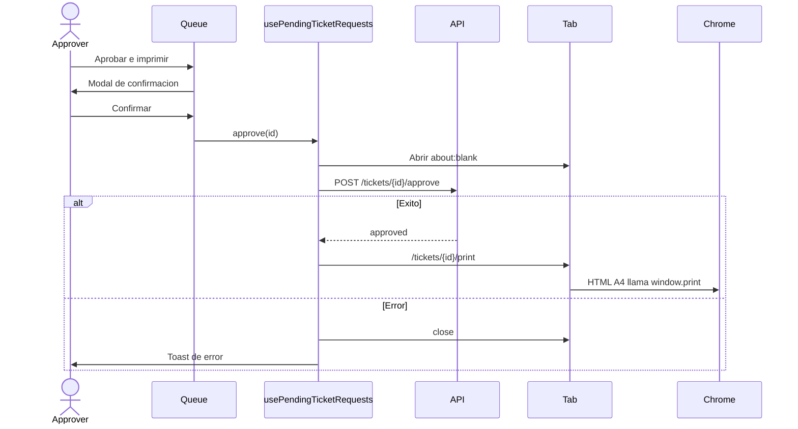
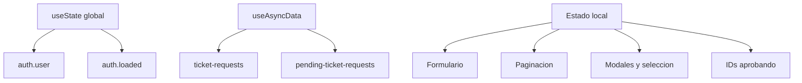
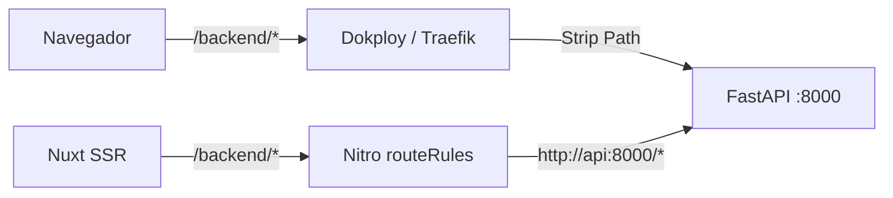

# Referencia de modulos del frontend

## Resumen

El frontend es una aplicacion Nuxt 4 con Vue 3, Nuxt UI y Tailwind CSS 4. Sigue una estructura Feature-Sliced pequena:

```text
frontend/src/
|-- app.vue
|-- app/                         Shell, rutas, middleware y estilos
|-- pages/
|   |-- login/                  Inicio de sesion
|   |-- home/                   Portal del empleado
|   `-- reception/              Portal de recepcion
`-- shared/
    |-- api/                    Tipos OpenAPI
    `-- auth/                   Sesion global
```

## Regla de dependencias



- `app` compone rutas y layout.
- `pages` contiene funcionalidad de negocio visible.
- `shared` no depende de paginas.
- Los componentes no llaman directamente a endpoints salvo el modulo transversal de autenticacion.

Steiger valida esta estructura con `pnpm lint:fsd`.

## Modulo `app`

### `src/app.vue`

Raiz visual:



`UApp` habilita servicios de Nuxt UI como toasts y overlays.

### Layout

`app/layouts/default.vue` proporciona:

- Cabecera de aplicacion.
- Marca y enlace a `/`.
- Nombre del usuario actual.
- Acceso a recepcion para aprobadores.
- Cierre de sesion.
- Slot de pagina.

La pagina de login desactiva este layout.

### Rutas

| Archivo | URL | Middleware | Resultado |
|---|---|---|---|
| `app/routes/index.vue` | `/` | `auth` | Redirige segun rol |
| `app/routes/login.vue` | `/login` | Ninguno | `LoginPage` |
| `app/routes/user.vue` | `/user` | `auth`, `user` | `HomePage` |
| `app/routes/recepcion.vue` | `/recepcion` | `auth`, `approver` | `ReceptionPage` |
| `app/routes/bloqueos.vue` | `/bloqueos` | `auth`, `rrhh` | Gestionar accesos |



### Middleware

`app/routing/auth.ts` carga `useAuth` una sola vez y redirige a login si no hay usuario.

`app/routing/user.ts` exige `role === "user"`.

`app/routing/approver.ts` exige `role === "approver"`.

La autorizacion frontend mejora la navegacion, pero el backend vuelve a validarla.

### Estilos globales

`app/styles/main.css` importa Tailwind y Nuxt UI y define:

- `--tickets-ink`
- `--tickets-muted`
- `--tickets-line`
- `--tickets-paper`
- `--tickets-canvas`

Los componentes usan estilos scoped y los tokens compartidos.

## Modulo `shared/auth`

### Finalidad

Mantener una unica sesion reactiva para layout, middleware y paginas.

`shared/auth/session.ts` expone `useAuth()`.

| Estado | Clave Nuxt | Uso |
|---|---|---|
| Usuario | `auth.user` | `UserDTO | null` |
| Cargado | `auth.loaded` | Evitar repetir `/auth/me` |

Metodos:

- `refresh()`: llama `GET /auth/me`, reenvia cookie durante SSR y actualiza estado.
- `login()`: navega a `${apiBase}/auth/microsoft/login`, conservando el prefijo `/backend`.
- `logout()`: llama `POST /auth/logout`, limpia estado y navega a `/login`.



## Modulo `shared/api`

`shared/api/openapi.ts` se genera desde el backend y no debe editarse manualmente.

```bash
pnpm --dir frontend generate:api
```

`shared/api/index.ts` ofrece alias cortos:

- `UserDTO`
- `PendingTicketRequestDTO`
- `TicketRequestDTO`
- `TicketRequestCreateDTO`
- `TicketRequestStatus`

## Modulo `pages/login`

### `LoginPage.vue`

- Comprueba sesion al montarse.
- Redirige a `/` si ya existe usuario.
- Muestra el acceso Microsoft tras completar la comprobacion.
- Usa `useAuth` directamente porque autenticacion es transversal.



## Modulo `pages/home`

### Finalidad

Permitir al empleado crear solicitudes, consultar estado y previsualizar tickets aprobados.

```text
pages/home/
|-- api/tickets.ts
|-- model/use-ticket-requests.ts
|-- ui/HomePage.vue
|-- ui/TicketRequestForm.vue
|-- ui/TicketRequestHistory.vue
`-- index.ts
```

### API

`api/tickets.ts`:

| Funcion | HTTP |
|---|---|
| `fetchTicketRequests` | `GET /tickets/` |
| `createTicketRequest` | `POST /tickets/` |

`TicketAmount` deriva del contrato OpenAPI y solo admite 11 o 22.

### Modelo

`use-ticket-requests.ts`:

- Carga historial con `useAsyncData("ticket-requests")`.
- Reenvia cookies en SSR.
- Ordena solicitudes de mas nueva a mas antigua.
- Mantiene cantidad seleccionada, envio y mensajes.
- Evita doble envio.
- Inserta la solicitud creada sin volver a consultar toda la lista.
- Redirige a login ante 401.

### `HomePage.vue`

Orquesta el formulario y el historial; no duplica logica de negocio.



### `TicketRequestForm.vue`

- Radio nativo para 11 o 22.
- Fieldset deshabilitado durante envio.
- Mensajes accesibles de exito y error.
- Emite `submit`; no conoce HTTP.

### `TicketRequestHistory.vue`

Responsabilidades:

- Estados loading, error, vacio y lista.
- Etiquetas `Pendiente`, `Aprobada`, `Rechazada`.
- Ocho solicitudes por pagina.
- Ajuste automatico si desaparece la ultima pagina.
- Modal fullscreen de previsualizacion.
- `iframe` A4 descargado al cerrar el modal.



El visor no genera un PDF: incrusta el HTML A4 existente. No ofrece descargar ni imprimir, aunque el navegador no puede bloquear completamente `Ctrl+P`.

## Modulo `pages/reception`

### Finalidad

Mostrar la cola FIFO, confirmar aprobaciones y abrir el documento en el dialogo nativo de Chrome.

```text
pages/reception/
|-- api/tickets.ts
|-- model/use-pending-ticket-requests.ts
|-- ui/ReceptionPage.vue
|-- ui/PendingRequestQueue.vue
|-- ui/PrinterSetupCard.vue
`-- index.ts
```

### API

| Funcion | HTTP |
|---|---|
| `fetchPendingTicketRequests` | `GET /tickets/pending` |
| `approveTicketRequest` | `POST /tickets/{id}/approve` |

### Modelo

`use-pending-ticket-requests.ts`:

- Carga con `useAsyncData("pending-ticket-requests")`.
- Ordena de mas antigua a mas reciente.
- Usa `Set<string>` para bloquear doble aprobacion por ID.
- Reserva una pestaña con `window.open()` antes del `await`.
- Aprueba, elimina la fila y navega la pestaña al documento.
- Cierra la pestaña si falla.
- Muestra toasts y refresca ante 400, 404 o 409.

La pestaña se abre inmediatamente para no perder el gesto que exige el bloqueador de popups de Chrome.

### `ReceptionPage.vue`

- Instancia el modelo.
- Muestra contador de pendientes.
- Conecta `PrinterSetupCard` y `PendingRequestQueue`.

### `PrinterSetupCard.vue`

Componente informativo. Explica que Chrome y Windows gestionan la impresora. No descubre, selecciona ni persiste dispositivos.

### `PendingRequestQueue.vue`

- Tabla en escritorio y tarjetas en movil.
- Ocho solicitudes por pagina.
- Skeleton, error con reintento y estado vacio.
- Modal con solicitante, cantidad y fecha.
- Emite `approve(id)` al confirmar.
- Muestra loading por fila con `approvingIds`.



## Modulo `pages/blocked-users`

Pantalla exclusiva de RRHH. Busca bajo demanda por nombre o correo en Microsoft 365, confirma
antes de bloquear y mantiene una lista local para desbloquear. No usa autocomplete, estado global
ni paginacion; el backend limita la busqueda a 20 resultados.

```text
pages/blocked-users/
|-- api/blocked-users.ts
|-- model/use-blocked-users.ts
|-- ui/BlockedUsersPage.vue
`-- index.ts
```

Un callback OAuth bloqueado vuelve a `/login?error=blocked`, donde se muestra el motivo sin crear
sesion.

## Estado y datos



No se usa Pinia ni Vuex porque el unico estado transversal es la sesion.

## Manejo de errores

| Flujo | Comportamiento |
|---|---|
| Carga de sesion | Cualquier error se interpreta como no autenticado |
| Crear solicitud 401 | Redirige a login |
| Crear solicitud 422 | Mensaje de cantidad invalida |
| Carga de historial | Estado de error con reintento |
| Iframe | Loading hasta `load`; sin inspeccion del status por ser otro origen |
| Popup bloqueado | No aprueba y muestra aviso |
| Aprobacion fallida | Cierra pestaña, muestra detalle y puede refrescar cola |

No hay interceptor HTTP, telemetria ni error boundary personalizado.

## UI y accesibilidad

- Nuxt UI: `UApp`, `UButton`, `UContainer`, `UIcon`, `UModal`, `UPagination`, `USkeleton` y toasts.
- Controles nativos para formularios.
- Tablas semanticas en escritorio.
- Etiquetas accesibles y regiones live para estados.
- Focus visible personalizado.
- Diseños responsive con componentes scoped.

## Configuracion

`nuxt.config.ts`:

- `srcDir: "src"`.
- Modulo `@nuxt/ui`.
- API publica por defecto `http://localhost:8000`.
- Proxy Nitro `/backend/**` hacia `http://api:8000/**`.
- Directorios personalizados para pages, layouts y middleware.

Configuracion local:

```dotenv
NUXT_PUBLIC_API_BASE=http://localhost:8000
```

Configuracion de produccion:

```dotenv
NUXT_PUBLIC_API_BASE=/backend
```

### Resolucion de la API en produccion

La misma ruta relativa tiene dos recorridos:



- En el navegador, Dokploy dirige `/backend` al servicio `api` y elimina el prefijo.
- Durante SSR, `$fetch` resuelve la ruta internamente y Nitro la envia al nombre Docker `api`.
- `useRequestHeaders(['cookie'])` reenvia la cookie de la peticion original a FastAPI.
- Login, logout, consultas e impresion comparten `config.public.apiBase`.

Antes se usaba la URL publica absoluta durante SSR. Eso obligaba al contenedor frontend a salir
por DNS, TLS y Traefik para volver al mismo despliegue, y produjo esperas de aproximadamente 21
segundos antes de `/auth/me`. La ruta relativa con proxy interno elimina ese recorrido circular.

## Scripts

| Script | Finalidad |
|---|---|
| `pnpm dev` | Servidor local |
| `pnpm build` | Build SSR/Nitro |
| `pnpm preview` | Ejecutar build local |
| `pnpm typecheck` | Validar TypeScript/Vue |
| `pnpm lint:fsd` | Validar arquitectura |
| `pnpm generate:api` | Regenerar tipos OpenAPI |

Desde la raiz se pueden ejecutar con `pnpm --dir frontend <script>`.

## Pruebas y limites

No existe suite frontend automatizada. La comprobacion actual es:

```bash
pnpm --dir frontend typecheck
pnpm --dir frontend lint:fsd
pnpm --dir frontend build
```

Limites actuales:

- Sin E2E ni pruebas de componentes.
- Los dominios, `Strip Path` y variables de produccion se configuran en Dokploy.
- El iframe no puede leer errores HTTP cross-origin.
- La paginacion es cliente; el backend devuelve la lista completa.
- La seleccion de impresora pertenece a Chrome, no a la aplicacion.
